# ⚖️ Nyaya Deepam — AI-Powered Indian Legal RAG System

> *"Nyaya Deepam" (न्याय दीपम्) — "Light of Justice" in Sanskrit*

A hybrid Retrieval-Augmented Generation (RAG) system built for Indian criminal law, enabling intelligent Q&A over the **Bharatiya Nyaya Sanhita (BNS) 2023** and **Indian Penal Code (IPC) 1860**, including BNS↔IPC section mappings.

---


##  Project Overview

Nyaya Deepam helps legal professionals, students, and citizens navigate the transition from the IPC (1860) to the BNS (2023) — India's new criminal code effective **1 July 2024**. It answers questions like:

- _"What is the BNS equivalent of IPC Section 420?"_
- _"What is the punishment for murder under BNS?"_
- _"Explain Section 33 IPC and its BNS equivalent."_

---
## Architecture



## 📁 Project Structure

```
nyaya_deepam/
├── raw/
│   ├── bns_rag.jsonl           # BNS 2023 chunks
│   ├── ipc_rag.jsonl           # IPC 1860 chunks
│   └── bns_ipc_rag.jsonl       # BNS↔IPC mapping chunks
│
├── artifacts/
│   ├── full/                   # Full corpus (BNS + IPC + Mapping + Composite)
│   │   ├── corpus.faiss        # FAISS vector index
│   │   ├── chunks.jsonl        # Text chunks
│   │   ├── chunks.csv          # CSV copy
│   │   └── manifest.json       # Index metadata
│   └── atomic/                 # Atomic corpus (no composite chunks)
│       ├── corpus.faiss
│       ├── chunks.jsonl
│       ├── chunks.csv
│       └── manifest.json
│
├── checkpoints/                # LoRA fine-tuned adapter weights
│   ├── adapter_config.json
│   └── adapter_model.safetensors
│
├── block1_build.py             # Index building pipeline
├── block2_inference.py         # Inference pipeline (base model)
├── block2_finetuned.py         # Inference pipeline (fine-tuned LoRA)
└── block3_key_search.py        # Enhanced inference with exact section lookup
```

---

## Quick Start

### 1. Prerequisites

```bash
pip install -r requirements.txt
```

### 2. Environment Setup

Create a `.env` file:

```env
EMAIL=your@email.com
HF_TOKEN=hf_xxxxxxxxxxxxxxxxxxxxxxxx
```

### 3. Build the Index (Block 1)

```bash
# RUN THE NOTEBOOK
```

This will:
- Load raw JSONL files from `nyaya_deepam/raw/`
- Build composite BNS↔IPC chunks
- Encode all passages using `intfloat/multilingual-e5-small`
- Save FAISS index + chunk metadata to `artifacts/full/` and `artifacts/atomic/`
- Optionally save Delta tables in Databricks

### 4. Run Inference (Block 3 — Recommended)

```bash
# RUN THE NOTEBOOK
```

---

## System Architecture

### Retrieval Strategy: Hybrid Search

The system combines two retrieval methods with a weighted fusion:

| Method | Weight (α) | Description |
|--------|-----------|-------------|
| Dense (FAISS) | 0.65 | Semantic similarity via multilingual embeddings |
| Sparse (BM25) | 0.35 | Keyword/term frequency matching |

**Combined score** = `0.65 × normalized_vector_score + 0.35 × normalized_bm25_score`

### Corpus Modes

| Mode | Contents | Best For |
|------|----------|----------|
| `atomic` | BNS + IPC + Mapping rows | Specific section lookups |
| `full` | atomic + Composite chunks | Cross-law comparisons |
| `auto` | Chosen by keyword detection | General queries |

**Mode detection keywords:** `equivalent`, `mapping`, `compare`, `ipc`, `bns`, `difference`, `changed`

### Exact Section Lookup (Block 3)

Before RAG retrieval, Block 3 attempts a **deterministic exact match**:

1. Parse the query for act name (`BNS`/`IPC`) and section number
2. Lookup in pre-built section dictionary from raw JSONL
3. If found, prepend to RAG context with `[Exact Match]` tag
4. LLM prioritises this over fuzzy retrieval results

---

## Models

| Component | Model | Purpose |
|-----------|-------|---------|
| Embeddings | `intfloat/multilingual-e5-small` | Dense vector encoding (multilingual) |
| LLM (base) | `Qwen/Qwen2.5-3B-Instruct` | Answer generation |
| LLM (fine-tuned) | LoRA adapter on Qwen2.5-3B | Domain-adapted generation |

### Fine-Tuning

The LoRA adapter (`checkpoints/`) was fine-tuned on Indian legal Q&A pairs to improve:
- Adherence to legal citation format
- Reduced hallucination on section numbers
- Better handling of BNS↔IPC mapping queries

Load with:
```python
from peft import PeftModel
base_model = AutoModelForCausalLM.from_pretrained("Qwen/Qwen2.5-3B-Instruct", ...)
model = PeftModel.from_pretrained(base_model, "./checkpoints")
```

---

## Data Format

### Raw JSONL Schema

```json
{
  "chunk_id": "BNS_103_1",
  "text": "Section 103. Murder. — (1) Whoever commits murder shall be punished...",
  "metadata": {
    "act_name": "Bharatiya Nyaya Sanhita, 2023",
    "chapter": "Chapter VI",
    "section": "103",
    "section_name": "Murder",
    "bns_section_subsection": "103",
    "ipc_section": "302"
  }
}
```

### Composite Chunk Format (Full Corpus)

```
BNS Section: 303
<BNS section text>

IPC Section: 379
<IPC section text>

Mapping and Changes:
<mapping/diff text>
```

---

## API Reference

### `answer_with_rag(user_query, top_k=4, mode="auto", max_new_tokens=256)`

**Parameters:**

| Parameter | Type | Default | Description |
|-----------|------|---------|-------------|
| `user_query` | str | — | Legal question in English or Hindi |
| `top_k` | int | 4 | Number of chunks to retrieve |
| `mode` | str | `"auto"` | `"full"`, `"atomic"`, or `"auto"` |
| `max_new_tokens` | int | 256 | Max tokens for LLM response |

**Returns:**

```python
{
    "mode": "atomic",
    "answer": "IPC Section 420 corresponds to BNS Section 318...",
    "retrieved": [
        {
            "score": 0.8421,
            "chunk_id": "BNS_318_1",
            "source": "BNS_2023",
            "act_name": "Bharatiya Nyaya Sanhita, 2023",
            "section": "318",
            "section_name": "Cheating",
            "text": "..."
        }
    ],
    "exact_match": {...},       # Block 3 only
    "used_exact_match": True    # Block 3 only
}
```

---

## 📝 Example Queries

Examples:

### Example 1


### Example 2


### Example 3


### Commands
```python
# Simple section lookup
answer_with_rag("What is Section 420 IPC?", mode="atomic")

# Cross-law mapping
answer_with_rag("What is BNS Section for IPC 420?", mode="atomic")

# Punishment query
answer_with_rag("What is the punishment for murder under BNS?")

# Comparison
answer_with_rag("Difference between IPC Section 95 and BNS equivalent")

# Definition lookup
answer_with_rag("What does Section 33 IPC define?")
```

---

## ⚙️ Configuration

| Variable | Default | Description |
|----------|---------|-------------|
| `EMBED_MODEL_NAME` | `intfloat/multilingual-e5-small` | Embedding model |
| `LLM_MODEL_NAME` | `Qwen/Qwen2.5-3B-Instruct` | Generation model |
| `alpha` | `0.65` | Dense retrieval weight in hybrid search |
| `top_k` | `4` | Retrieved chunks per query |
| `max_new_tokens` | `256` | LLM generation length |
| `USE_FINETUNED` | `True` | Use LoRA adapter |

---

## Legal Context

| Law | Full Name | Year | Status |
|-----|-----------|------|--------|
| **BNS** | Bharatiya Nyaya Sanhita | 2023 | In force from 1 July 2024 |
| **IPC** | Indian Penal Code | 1860 | Replaced by BNS |

The BNS modernises India's criminal code by:
- Renumbering and restructuring sections
- Adding offences for cybercrime and terrorism
- Revising punishments
- Removing colonial-era language

---

## 🛠️ Tech Stack

| Layer | Technology |
|-------|-----------|
| Embeddings | `sentence-transformers` + `intfloat/multilingual-e5-small` |
| Vector Search | `FAISS` (IndexFlatIP — inner product) |
| Keyword Search | `rank-bm25` (BM25Okapi) |
| LLM | `Qwen2.5-3B-Instruct` via `transformers` |
| Fine-tuning | `PEFT` (LoRA) |
| Data | `pandas` + JSONL |
| Platform | Databricks (Delta Lake + Workspace FS) |

---

## Environment Variables

| Variable | Required | Description |
|----------|----------|-------------|
| `EMAIL` | ✅ | Your Databricks/Workspace email (used for path resolution) |
| `HF_TOKEN` | ✅ | Hugging Face API token (for model downloads) |

---

## Known Limitations

- Section number regex (`extract_act_and_section_from_query`) covers common formats but may miss edge cases like `Section 3A` or `Section 1(3)(a)(ii)`
- Composite chunks are only built for sections present in the mapping JSONL
- The `choose_mode` keyword list may route ambiguous queries incorrectly
- Model runs best on GPU; CPU inference is slow for 3B-parameter models

---

## Contributing

Pull requests welcome. For major changes, open an issue first. Please ensure all test queries from `block3_key_search.py` continue to produce correct answers.

---

## License

This project is for educational and research purposes. Legal text (BNS/IPC) is sourced from official Government of India publications and is in the public domain.

---

*Built for the Hackathon — Bridging India's Legal Transition with AI*
